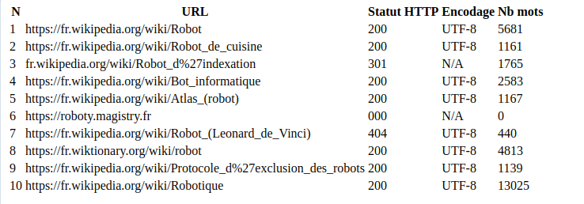

> *Note pour comprendre comment je prends mes notes :*
> En fait moi de base je prends mes notes de cours via un logiciel qui s'appelle **Obsidian** qui permet de prendre des **notes en markdown** (un peu étendu). 
> Comme je trouvais ça bête de faire doublon entre mes notes déjà en markdown synchronisée sur un dépôt git perso et celui que vous attendez de nous pour le cours, je fais un compromis : 
> - j'ai cloné mon dépôt "PPE-2025" dans mon arborescence de fichiers où je prends mes notes de cours, comme ça je peux ouvrir la note actuelle (journal.md) comme mes autres notes via Obsidian. 
> - Pour m'assurer une bonne intégration et une mise en lien entre mes notes perso et celles que vous nous imposez, **je me fais (pour moi) des liens parfois vers les notes que je prends dans mes notes perso**. Dans Obsidian, ça prend la forme de *double crochets*. Donc si vous voyez par exemple [[Projet de programmation encadré|PPE]] c'est parce que je fais référence à ma note en markdown pour le cours de PPE.
> - Autres spécificités aux notes telles que je les prends : Obsidian permet quelques options supplémentaires comme les *blocs* (comme le bloc "Attentes" ci-dessous, que vous voyez probablement juste comme un bloc de citation) et les ==surlignage== qui prennent la forme d'un encadrement par des signes égal.
> - Globalement je vais souvent des liens vers mes notes perso. Par exemple moi de base si en faisant un exo je vois que telle option est pratique à utiliser pour telle fonction, je préfère aller l'écrire directement dans la notre dédié à cette fonction, parce que ça me fait une sorte de "wiki perso" et je retrouve bien plus vite l'info le jour où je veux réutiliser cette fonction. J'avoue je me force un peu à écrire dans le journal du coup, et ça me fait pas mal de doublons... mais bon 🤷 c'est intéressant aussi de pouvoir retracer au jour le jour.

(note écrite a posteriori, répète probablement des trucs du journal)

# Journal de bord du projet encadré

Pour le cours de [[Projet de programmation encadré]].

> [!Attentes]
> - Journal de bord individuel.
> - Notes un peu au jour le jour (hebdo ?).
> - Je peux aussi y noter si je découvre des fonctions ou manips sympas, des tests.
> - Notes les arguments pratiques pour les fonctions qu'on apprend à utiliser.
> - Quelles manoeuvres j'ai fait, qu'est-ce qui s'est bien passé, qu'est-ce qui s'est mal passé ?

> Le journal de bord vous servira tout au long de cette unité d’enseignement, vous devrez y écrire régulièrement pour faire part de votre avancement. Vous devrez y indiquer notamment **les problèmes que vous avez rencontrés et les solutions que vous avez trouvées**. 

[[git-intro-exercices.pdf#page=3&selection=85,0,93,12|git-intro-exercices, page 3]]

### Mes idées de réalisation / questions 
- markdown ? rédigé sous Obsidian? --> vu que je prends déjà mes notes sous markdown dans Obsidian...
- [x] voir si c'est possible de partager juste une note de mon repo obsidian (la note active)  [completion:: 2025-10-06]
	- je vais plutôt créer un nouveau répo git dans lequel je mets uniquement les notes de PPE (cours et exos) en guise de journal de bord
- ~~sinon juste je copie colle la note (déjà en markdown) si on est censé envoyer ~~


## Wed 24.09.2025 - cours d'intro

Je connais déjà la plupart de ce qu'on apprend (cours avec intro au bash suivi et utilisation pendant mon mémoire l'année dernière + dans ma vie de tous les jours). Mais comme j'ai tout fait en allemand ou anglais jusqu'ici je suis **contente de l'entendre bien expliqué en français (ma langue maternelle).** :)
Aussi très contente parce que j'ai découvert le bash expliqué par des allemands ingénieur en génie mécanique, et je trouvais ça vachement moins clair et sympa que quand c'est *expliqué par des intéressés de linguistique* (l'étant moi-même) parce qu'on a plus une approche linguistique (par ex. description du bash comme "*langue à verbe initial*").

*Intérêt particulier pour le petit point culture / histoire :)*

Des fois je m'emmêle un poil entre les chemins absolus / relatifs, en particulier je n'étais pas trop sûre de la notion de répertoire actuel qu'on peut désigner par `./`.
Aussi intéressant le point sur la vision de tout comme fichier, et d'une arborescence unique (Linux -/- Windows sur ce point).

Je pense pas beaucoup faire de recherches/tests pour le moment en dehors du cours car je connaissais tout ce qu'on a vu.

En fait moi je prends mes notes dans mon repo Obsidian, il faudrait que je montre aux profs et que je demande comment je peux faire converger mon orga perso et leurs attentes.


---

⚫️⚫️⚫️
Pour la suite j'ai juste pris mes notes de cours dans Obsidian.

[[Cours 1 PPE Unix]]
[[Cours 2 PPE git]]

---

### Exercice 1 : créer une arborescence pour classer les documents
Ici : [[unix.pdf#page=23&selection=0,0,0,8|unix, page 23]]

On a téléchargé une archive .zip qu'on a unzip avec `unzip`.

Après avoir trié les images dans `img/`, les documents dans `docs/`, les annotations dans `ann`, et les textes dans `txt`, je recrée des sous-dossiers en triant par nom : 
- Pour les textes et annotations, je lis la date indiquée pour mettre dans le dossier correspondant.
- Pour les images, je cherche les expressions dans le nom des fichiers qui me donnent une indication sur le lien (Paris ou Tokyo) avec [[grep]].
```sh
ls | grep Tokyo
```
Qui renvoie : 
```sh
0-Paris,Tokyo2.JPG
0-Tokyo!_film_poster.jpg
100-Tokyo_Reverie.jpg
101-Tokyo_Road_best_of_Bon_Jovi.jpg
102-Tokyo_Sando_logo.png
103-Tokyo_Seikatsusha_Network.png
104-Tokyo_Sports.jpg
105-Tokyo_Sungoliath_logo.jpg
106-Tokyo_Super_Wars_official_poster.jpg
...
```

Et toutes ces lignes, on va les bouger dans le sous-dossier `Tokyo/`.
Mais en fait là tout de suite je suis pas encore assez au point sur les [[pipe]] pour les commandes à plusieurs arguments pour faire ça avec `grep` (il faudrait que j'utilise la sortie de grep comme premier argument de `mv` et que je puisse ensuite indiquer le sous-dossier `Toyko/`).
Donc pour le moment on va tout faire avec des [[caractères de remplacement]] ! :p

```sh
ls *Tokyo*
```

*Note :* les deux commandes nous donnent bien les mêmes résultats ici (j'ai vérifié avec le nombre de résultats `ls | grep Tokyo | wc -l` vs `ls *Tokyo* | wc -l`).

Donc, après avoir créé le sous-dossier  `Tokyo/`, j'ai lancé :
```sh
mv *Tokyo* Tokyo/
```
- Bon, petit souci annoncé qui est donc qu'en théorie j'essaie aussi de déplacer l dossier `Tokyo/` dans lui-même (action qui échoue heureusement). Ce serait peut-être bien que je trouve une *option sur mv* pour mettre une exception (p.ex : pas les dossiers, ou pas un certain fichier). ✅ 2025-11-06
	- ça semble se faire de façon plus complexe que ce que je voudrais (même si ce n'est pas super dur non-plus, j'aurais aimé une simple option sur la commande `mv`) -> quelques sources : [ici](https://unix.stackexchange.com/questions/147290/move-every-file-that-is-not-a-directory#:~:text=There%20is%20one%20way%20to%20match%20by%20type%3A,mv%20--%20%2A%2F%20%22%24tmp%22%20mv%20--%20%2A%20other_directory%2F), 
	- `find . -type f -exec mv {} /destination_folder/ \;`
	- pour mon cas d'usage, je pense que ça suffit largement de laisser le terminal repérer qu'il ne peut pas déplacer un dossier dans lui-même.

Après globalement j'ai finalement décidé de faire un petit script qui permet de re-ranger les fichiers dans les dossiers adaptés, avec des [[boucles en bash]].

Wed 15.10.2025
Finalement j'ai refait le tri avec ce petit script. 

```sh
#!/bin/bash
for ANNEE in 2016 2017 2018; do
    
    # premier gros tri par année
    mkdir $ANNEE
    mv ${ANNEE}* ${ANNEE}/

    # sous tri par mois
    cd $ANNEE
    for month in {01..12}; do
        mkdir $month
        # mv ${dossier}_${month}* $month/
        mv ${ANNEE}_${month}* $month/
    done
    cd ..
done
```

Il faut vraiment faire bien attention aux utilisations de variables dans un nom "composé" de chemin. Par exemple, quand je faisais `mv $ANNEE_${month}* $month/` ça ne marchait pas : il faut bien mettre les accolades autour de `${ANNEE}`.


---

## Mon 06.10.2025 : Exercice git, manipulation de fichiers, tag

[[git-intro-exercices.pdf]]
Mon 06.10.2025

Création d'un repo git dans lequel on mettra le [[journal]]. 
Concrètement moi je vais déplacer mes notes faites dans Obsidian dans un repo public pour les profs. Ou peut-être juste les notes d'exercices/projet ..?

Lien vers mon repo : https://github.com/Tejante132/PPE1-2025.git 

On en copie l'adresse [[SSH]] pour faire le lien entre un dossier local et le dépôt (repo) GitHub, y publier des modifications de dépôt via le protocole SSH.
```sh
git clone git@github.com:Tejante132/PPE1-2025.git
```

*Note* : GitHub ne supporte plus de publier les modifications de dépôt via protocole HTTPS pour des raisons de sécurité. Enfin c'est possible mais il faut se connecter à chaque fois, alors qu'*en utilisant l'adresse SSH pour cloner le repo, on s'identifie avec notre [[clé ssh]].*

Lorsqu'on clone un dépôt, **un dossier au nom de ce dépôt est automatiquement créé** dans le dossier courant (où on a effectué la commande `git clone`). 

---

On teste l'utilisation du clonage : j'ai créé et "commit" un fichier markdown appelé `journal.md` depuis le site internet de GitHub, et maintenant on va voir ce qu'affiche la commande [[git status]] (normalement elle affiche qu'il nous manque un fichier).

```sh
clotilde@clotilde-Aspire:~/Documents/Obsidian Vault/Obsidian-Plurital/S7/PPE1-2025$ git status
On branch main
Your branch is up to date with 'origin/main'.

nothing to commit, working tree clean
```

Alors a priori finalement pour le moment il ne me dit rien, mais c'est logique car je n'ai pas récupéré les informations des dernières modifications, donc ma version locale ne sait pas qu'il y a une nouvelle version de la banche main. A ses yeux, on est à jour...
 
 Je vais tester ce que changent les acctions : `git fetch` (métadonnées uniquement), et `git pull` (importe les modifications). 
 
```sh
clotilde@clotilde-Aspire:~/Documents/Obsidian Vault/Obsidian-Plurital/S7/PPE1-2025$ git fetch
remote: Enumerating objects: 4, done.
remote: Counting objects: 100% (4/4), done.
remote: Compressing objects: 100% (2/2), done.
remote: Total 3 (delta 0), reused 0 (delta 0), pack-reused 0 (from 0)
Unpacking objects: 100% (3/3), 997 bytes | 997.00 KiB/s, done.
From github.com:Tejante132/PPE1-2025
   49cd1db..d70ec29  main       -> origin/main
   
clotilde@clotilde-Aspire:~/Documents/Obsidian Vault/Obsidian-Plurital/S7/PPE1-2025$ git status
On branch main
Your branch is behind 'origin/main' by 1 commit, and can be fast-forwarded.
  (use "git pull" to update your local branch)

nothing to commit, working tree clean
```

Après avoir utilisé `git fetch`, l'utilisation de `git status` repère maintenant bien qu'on a du retard sur la dernière version de la branche main (sans avoir importé ces modification). D'où le message : "Your branch is behind 'origin/main' by 1 commit".

On récupère les dernières mises à jour (le fichier `journal.md`) en utilisant `git pull`.

...

Et là je viens de regarder le pdf et de voir que je devais peut-être faire autre chose, mais c'est pas grave.
On teste l'utilisation de `git log`:
```sh
clotilde@clotilde-Aspire:~/Documents/Obsidian Vault/Obsidian-Plurital/S7/PPE1-2025$ git log
commit d70ec29f334a68a369596c6f173a774ffd0cf6d5 (HEAD -> main, origin/main, origin/HEAD)
Author: Clotilde Guyard-Gilles <100777239+Tejante132@users.noreply.github.com>
Date:   Mon Oct 6 16:01:32 2025 +0200

    Create journal.md
    
    Ajout du journal de bord

commit 49cd1db551c50f1d3bdc5d3fb0cf36992516d6cf
Author: Clotilde Guyard-Gilles <100777239+Tejante132@users.noreply.github.com>
Date:   Mon Oct 6 15:47:08 2025 +0200

    Initial commit
```

Ça nous liste les commits qui ont été faits. Pour le moment on en a très peu, donc pas trop envahissant, mais s'il y en avait plein et qu'on voulait sortir du journal, on pourrait le quitter en touchant la touche "q" (*quit*).

On fait maintenant des modifs locales au fichier (ce que je fais actuellement ;))) )

Donc en utilisant `git status` on devrait maintenant voir qu'on est en avance par rapport au main:
```sh
On branch main
Your branch is up to date with 'origin/main'.

Changes not staged for commit:
  (use "git add <file>..." to update what will be committed)
  (use "git restore <file>..." to discard changes in working directory)
	modified:   journal.md

no changes added to commit (use "git add" and/or "git commit -a")
```

En fait finalement ça nous dit juste qu'on n'est à jour sur le main, mais qu'on a fait de nouvelles modifications sur `journal.md`. Par contre il nous dit que c'est pas nécessaire d'`add` les changements, mais c'est peut-être dû à l'application que j'utilise pour prendre mes notes, sur lesquels j'exécute automatiquement régulièrement des scripts pour pull, add et push les dernières modifications.

Du coup par curiosité je regarde ce que ça change si je fais `git add .` dans mon dépôt local puis re `git status`.
Quand je dis `git add .`, rien ne s'affiche --> **parce que je n'ai pas créé de nouveau fichier ? peut-être que `add` / `rm` c'est uniquement pour les nouveaux fichiers, et les `commit` sont pour les changements??**.--> je pense que le `commit` c'est à la dois ajouts de fichiers et modifications recensées. `add` par contre c'est que pour les nouveaux fichiers.

Maintenant, `git status` donne : 
```sh
On branch main
Your branch is up to date with 'origin/main'.

Changes to be committed:
  (use "git restore --staged <file>..." to unstage)
	modified:   journal.md
```

Donc on va pouvoir les `commit` !

On enlève de la synchro git un potentiel fichier qui nous embête `.DS_STORE` grâce à un fichier `.gitignore`. Je le crée depuis mon terminal avec `touch`. Dans le fichier, on note simplement `.DS_STORE`. Je le fais aussi depuis le terminal avec : 
```sh
echo ".DS_STORE" >> .gitignore
```

Note : il faut `commit` normalement avant d'appliquer un **tag** sur un commit.
```sh
clotilde@clotilde-Aspire:~/Documents/Obsidian Vault/Obsidian-Plurital/S7/PPE1-2025$ git commit -m "commit fin exo pour tester le tag"
[main ac78641] commit fin exo pour tester le tag
 2 files changed, 170 insertions(+)
 create mode 100644 .gitignore
```

Et pour finir on crée un tag et on le push (cf [[git tag]], notes de [[Cours 2 PPE git]]) : nom du tag "gitinto" et message "version finie intro git".

```sh
git tag -m "version finie intro git" gitinto
git push origin gitinto
```

Qui nous affiche : 
```sh
Enumerating objects: 7, done.
Counting objects: 100% (7/7), done.
Delta compression using up to 16 threads
Compressing objects: 100% (4/4), done.
Writing objects: 100% (5/5), 4.21 KiB | 4.21 MiB/s, done.
Total 5 (delta 0), reused 0 (delta 0), pack-reused 0
To github.com:Tejante132/PPE1-2025.git
 * [new tag]         gitinto -> gitinto
```

Maintenant on va regarder sur GitHub ce que ça a donné pour le lien.

**Question : si je veux rajouter des modifications au tag, est-ce que c'est possible ?? pour avoir des versions 1.x par exemple.** 

On va tester voir, mais je pense qu'un tag ne peux être qu'unique, donc par exemple ce serait à moi de nommer le tag différemment, par exemple avec un nouveau tag qui s'appelle "gitinto.1" (avec un versionnement mineur de la version gitinto).

Effectivement ce n'était pas possible de juste refaire un `git tag -m "bla" gitinto`:
```sh
fatal: tag 'gitinto' already exists
```

Donc à la place j'ai fait : 
```sh
git tag -m "test de modifications sur un tag deja push" gitinto.1
git push origin gitinto.1
```
En créant donc un nouveau tag.

La question que je me pose par contre maintenant c'est si je pouvais commit et push directement dans un tag déjà existant, sans réutiliser la commande `git tag`.

Ça semble avoir marché !
```sh
clotilde@clotilde-Aspire:~/Documents/Obsidian Vault/Obsidian-Plurital/S7/PPE1-2025$ git commit -m "encore un test pour modifier un tag"
[main c49d815] encore un test pour modifier un tag
 1 file changed, 16 insertions(+), 1 deletion(-)
clotilde@clotilde-Aspire:~/Documents/Obsidian Vault/Obsidian-Plurital/S7/PPE1-2025$ git push origin gitinto
Everything up-to-date
```

Spoiler non en fait c'est l'ancienne version qui est en ligne.

Mais partie fun : **en fait il faut continuer à push normal dans le main à côté des tags**, parce que là la version du main est à jour d'il y a 53 minutes alors que mon tag est à jour d'il y a 12min.

Note : je pense que le but c'était de l'appeler gitintro donc mon dernier sera gitintro ;)

---

## Wed 08.10.2025 - Exos scripts bash
cf [[bash|scripts bash]] (mes notes perso sous Obsidian)

On lit les nouvelles slides de [[unix.pdf#page=26&selection=2,0,2,2|unix, page 26]] sur les lignes de commandes -> scripts.
Introduction aux différents [[flux d'entrée-sorties standard]] et [[redirection vers et depuis des fichiers]].

Mes points de doute : 
- [x] pas 100% sûre là comme ça de comment on utilise `<` (par contre les `>` sont bien clairs)  [completion:: 2025-10-08]
	-> *exemple :* `wc < fic.txt` : on redirige le contenu du fichier `fic.txt` dans le stdin.
- [ ] pour la [[redirection vers et depuis des fichiers]] : vérifier si la redirection de la sortie d'erreur se fait avec `&<`, `<&` ou les deux ?
- [x] `wc` : le nom laisse entendre que ça compte les mots, mais je crois qu'en réalité ça compte plutôt les lignes. Tester avec et sens option `-l`. ✅ 2025-11-06
	- [[wc]] peut compter des mots ou des lignes selon l'option qu'on lui donne (respectivement `-w` et `-l`)

On va fair des manipulation sur les [[fichiers .ann]] utilisés à la séance précédente.
-> Avant ça je suis allée finir le tri parce que je ne l'avais pas fait, comme je savais déjà faire (déjà fait un peu de bash dans mes études d'ingé) et que je ne savais pas qu'on en aurait besoin.....

Wed 15.10.2025
### Ex 1 scripts -exos (cours unix.pdf) 
#### v1 à côté de la plaque
**But**
- Écrire un script qui compte les entités *pour une année* un type d’entité donnés en argument du programme
	- on va utiliser `grep` et `wc` avec un argument donné du style `txt` ou `ann`.
	- je crée aussi une variable avec le type d'entité
- Écrire un second script qui lance le script précédent trois fois, une fois pour chaque années, en prenant le type d’entité en argument.
	- pour ça, on fait une boucle for sur les trois années.
Dans la boucle, j'utilise : 
```sh
ls -l $ANNEE/* | grep ".${ENTITE}" | wc -l
```

**Mes points de difficulté :** 
- au début j'ai créé une variable avec une affectation mal rédigée, puisque j'ai mis des espaces autour du `=`... attention à bien coller comme ça : `ENTITE=$1`.
- somehow ça me compte rien, je ré-essaie... -> le souci était que j'avais fait `ls -l $ANNEE` puis grep etc, mais la seule chose qui était contenue dans chaque répertoire d'année était des sous-dossiers par mois. J'ai donc rajouter le `\*` pour regarder plus loin.

Résultats : 
```sh
$ ./ex1_scripts.sh ann
On va compter les fichiers ann
Nombre de fichiers .ann en 2016: 
571
Nombre de fichiers .ann en 2017: 
393
Nombre de fichiers .ann en 2018: 
227
```

```sh
$ ./ex1_scripts.sh txt
On va compter les fichiers txt
Nombre de fichiers .txt en 2016: 
571
Nombre de fichiers .txt en 2017: 
393
Nombre de fichiers .txt en 2018: 
227
```

---
#### v2 plus sur le bon chemin
En fait je viens d'apprendre que c'était pas du tout ça l'exercice ! oups ;)
Donc je refais, cette fois-ci avec l'objectif de compter à l'intérieur d'un document les [[entité nommée]]s :

**But**
- Écrire un script qui compte les entités *pour une année* un type d’[[entité nommée]] donnés en argument du programme *(ex : Location, Person, Date, Organization)*
	- on va utiliser sur des fichierrs .ann données `grep` et `wc` avec un argument donné du style Date, Person, ...
	- je crée aussi une variable avec le type d'EN donné qui sera utilisé dans grep
- Écrire un second script qui lance le script précédent trois fois, une fois pour chaque années, en prenant le type d’entité en argument.
	- pour ça, on fait une boucle for sur les trois années.

J'ai fait comme ça : 
```sh
EN=$1 # entité nommée
echo "On va compter les ${EN}s"
cd ann # on va là où sont rangées les annotations
for ANNEE in 2016 2017 2018; do
    # compte les EN pour cette année dans chacun des fichiers
    echo "On compte les ${EN}s en $ANNEE :"
    cat $ANNEE/*/* | grep $EN | wc -l
done
cd ..
```

Que j'ai exécuté comme ça:
```sh
$ bash ../ex1_scripts.sh Location
On va compter les Locations
../ex1_scripts.sh: line 32: cd: ann: No such file or directory
On compte les Locations en 2016 :
3144
On compte les Locations en 2017 :
2466
On compte les Locations en 2018 :
3110
```
--> petit souci : j'ai écexuté le programme déjà dans le dossier ann donc c'était pas la peine de mettre un cd ann dans le programme (ou alors j'aurais dû écrire le *chemin absolu* pour que ça marche qu'importe d'où on exécute le programme)
--> ou alors encore ! j'aurai pu faire en sorte que le chemin vers le dossier soit un *paramètre du programme* pour que j'adapte selon d'où je lance le programme.

> [!J'ai appris]
> - que ça marche de faire `cat *` dans un répertoire pour afficher **toutes les lignes de toues les fichiers** qu'on peut lire dans le répertoire actif (**les unes après les autres**). Pratique pour grep.
> - que par contre le rayon d'action de ce genre de commandes c'est uniquement le répertoire acutel (*pas sous-dossiers*), mais je peux choisir à quelle "profondeur" je veux aller en utilisant un nombre correspondant de `/*/`. Par exemple ici on a une structure `ann/année/mois/fichiers_correspondants.ann`, donc en étant dans `ann`, si je voulais afficher les fichiers ann, je devais afficher tous les mois avec une `*` (cf code).


---

### v3 : la fiche d'exos ??
Booon en fait je viens encore de voir qu'il vallait mieux suivre les exos de la fiche d'exos plutôt que ceux du cours. cf [[01-scripts-exercices.pdf]].

> J'avoue m'énerve un peu parce que j'avais fait les exos donnés dans les slides de cours et ils sont légèrement différents de ceux dans la fiche de TD mais sont quand-même proches. :(
> Je verrai si j'ai la foi de refaire exactement le TD pendant les vacances, pour le moment je me concentre sur suivre en direct ce qu'on fait maintenant pour pas prendre de retard.

### Ex 2 scripts -exos (cours unix.pdf) 
- [x] créer un script pour établir le classement des lieux les plus cités. ✅ 2025-11-06
- [x] prendre en argument l’année, le mois et le nombre de lieux à afficher ✅ 2025-11-06
- [x] accepter * pour l’année et le mois. ✅ 2025-11-06

Outils à utiliser : 
- tail ou `head` (sélectionner un certain nombre de lieux)
- trier ?? `sort` ?? `uniq` !!!

Pour le moment j'ai ça : 

```bash
echo "Nb d'arguments donnés : $#"

if [ $# -ne 3 ] # On n'a pas donné 3 arguments
then
    echo "Merci de donner 3 arguments svp : année (2016, 2017, 2018 ou toutes "*"), mois (tous : "*"), nombre de lieux à afficher (classement des lieux les plus cités)"
    exit
fi

ANNEE=$1
MOIS=$2
NB_LIEUX=$3
EN="Location" # entité nommée

echo "On va trier les ${NB_LIEUX} ${EN}s les plus mentionnées en ${MOIS} ${ANNEE}."

# Prise en compte de l'astérisque
cat ann/${ANNEE}/${MOIS}/* | grep "Location" | ... # à compléter
```

Là j'ai juste la liste de tous les lieux. Pour compter le nombre d'apparition de chaque lieu et les trier par nombre d'apparition, je vais investiguer sur les options de `uniq` et `sort`.

`uniq` possède l'option suivante : 
```
  -c, --count           prefix lines by the number of occurrences
```
Ce qui serait niquel pour moi comme première liste sur laquelle utiliser `sort`.
Par contre avant ça il faudrait que je ne garde que la dernière colonne (colonne avec nom du lieu).

Je regarde de plus près le format des annotations. Ligne typique : 
```
T7	Location 195 223	18 e arrondissement de Paris
```
Avec `TXX` (n° d'annotation) puis **tabulation** puis `<EN_type> XXX XXX` puis **tabulation** puis le nom de l'EN (ce qu'on veut garder).

En cours, on a mentionné la commande `cut` qui a cet effet : 

| Commande | Action                                                                        | Exemple                                          |
| :------- | :---------------------------------------------------------------------------- | :----------------------------------------------- |
| `cut`    | Extrait certaines colonnes ou champs d’un texte (par position ou séparateur). | `cut -d',' -f2 data.csv` (extrait la 2ᵉ colonne) |
Pour mon cas, le délimiteur de colonnes et la tabulation `'\t'`.
Donc je tente :
```bash
cat ann/${ANNEE}/${MOIS}/* | grep "Location" | cut -d$'\t' -f3
```

(j'ai piqué l'idée du `cut -d$'\t' -f3` [ici](https://unix.stackexchange.com/questions/35369/how-to-define-tab-delimiter-with-cut-in-bash))

Maintenant on y applique `uniq -c` pout compter (`--count`).

```bash
cat ann/${ANNEE}/${MOIS}/* | grep "Location" | cut -d$'\t' -f3 | uniq -c
```

Ça ne marche que mollo mollo... puisque je vois par exemple des doublons de Locations : 
```
  1 Royaume-Uni
  1 Ukraine
  1 Allemagne
  1 Espagne
  1 Italie
  1 France
  1 Royaume-Uni
```
*Extrait du `uniq` : on voit 2 fois Royaume-Uni compté "1 fois.*
Pourtant, certaines autre lignes ont bien autre chose que 1 (je ne vois que quelques 2, un 4, un 3).

Là en faisant ça:
```bash
cat ann/${ANNEE}/${MOIS}/* | grep "Location" | cut -d$'\t' -f3 | uniq -c | sort -bgr
```

Ça me trie bien d'abord par nombre d'apparition puis par nom de lieu.
Mais j'ai toujours le souci (maintenant d'autant plus flagrant) des noms présents plusieurs fois mais comptés moins de fois.
Par exemple je fois 7 fois "Burundi" mais compté comme "4"...

Si vraiment ça ne marche pas, je pourrai lire les valeurs uniques des noms de lieux, et pour chacun chercher le nombre de fois où il apparait. Mais ça ne me sembl pas très efficace.

Je me demande s'il y a le souci de retours de ligne, dû éventuellement à la concaténation de différents documents.

Recherches sur internet...
Une solution est de **d'abord trier les lignes** avant de les passer dans `uniq`, qui ne compte que les *lignes consécutives qui se répètent*.

```bash
cat ann/${ANNEE}/${MOIS}/* | grep "Location" | cut -d$'\t' -f3 | sort | uniq -c -i | sort -bgr
```

Note : l'option `-i` rend insensible à la casse.

Et maintenant, en appliquant `tail -n ${NB_LIEUX}` à la fin, on a notre classement ! 

Exemple d'utilisation : 
```bash
$ bash compte_lieux.sh 2018 12 5
Classement des 5 Locations les plus mentionnées en 12 2018.
    150 Paris
    103 france
     76 Champs-Élysées
     28 A9
     24 A7
```


---

## Wed 15.10.2025 - Instructions de contrôle

Petite update du sccript fait pour le tri pour tester le fait de vérifier les arguments. J'ai rajouté au début (avant d'exécuter le reste du code) : 
```sh
EN=$1 # entité nommée

if [ -z  $EN] # aucun argument n'a été donné
then
    echo "donnez un type d'entité nommée (ex : Location, Person, Organization) en argument svp"
    exit
else
    echo "On va compter les ${EN}s"
fi
```

Et testé d'essayer de lancer le script avec et sans EN donnée : 
```sh
sh-5.2$ bash ../ex1_scripts.sh 
donnez un type d'entité nommée (ex : Location, Person, Organization) en argument svp
sh-5.2$ bash ../ex1_scripts.sh Location
../ex1_scripts.sh: line 30: [: missing `]'
On va compter les Locations
On compte les Locations en 2016 :
3144
On compte les Locations en 2017 :
2466
On compte les Locations en 2018 :
3110
```

Top!

### Description de ce qu'il se passe dans le code donné en fin du cours [[unix.pdf]] 

Annotation d'un code :
```sh
#!/usr/bin/bash    # shebang

if [ $# - ne 1 ]    # si le nombre total d'arguments n'est pas 1
then 
	echo " ce programme demande un argument "  # prévient (msg d'erreur)
	exit  # interrompt le programme
fi   # sortie de structure `if`


FICHIER_URLS=$1  # affectation de la valeur donnée en argument
OK=0  # création de deux variables OK et NOK de valeurs 0
NOK=0 

while read -r LINE ; # je suppose que a veut dire qu'on a de quoi lire  ??? mais c'est qui LINE ici ?
do 
	echo "la ligne : $LINE" 
	if [[ $LINE =∼ ^https?:// ]]  # on teste avec regex si la ligne correspond à une adresse web / un site
	then 
		echo " ressemble à une URL valide " 
		OK = $(expr $OK + 1)  # itéré compte les adresses web valides
	else 
		echo " ne ressemble pas à une URL valide "
		NOK = $(expr $NOK + 1)  # itère le compteur d'URL pas OK
	fi 
done < $FICHIER_URLS # ah ben je crois que je sais : les LINES sont lues dans le fichier donné ici à la boucle while...do...done

echo " $OK URLs et $NOK lignes douteuses "
```


*Ce que fait ce code :* 
- Si le nombre total d'arguments n'est pas 1, prévient qu'il faut un argument et quitte le programme.
- *... (voir commentaires dans le code)*
- $FICHIER_URLS donne le chemin vers le fichier texte (==au while read== )
	- il y a un chevron dans `done < $FICHIER_URLS` 
	- ici le contenu du fichier est "branché" sur l'entrée standard du done... -> il répond en fait à tout le bloc `while ... do ... done` 
- `read` -> cf page d'aide pour savoir comment ça marche.. ([[read]])

### `read`
La commande `read` en Bash est utilisée pour *lire une ligne de texte depuis l'entrée standard (par défaut)* ou un descripteur de fichier, et **l'assigner à une ou plusieurs variables**.

Prend en **argument un nom de variable** et stocke sur l'entrée standard...
- retourne vrai tant que ça reçoit des choses,
- une fois que ça arrive au bout du fichier (plus rien dans l'entrée standard) : renvoie faux -> permet de sortir de la boucle 

`read` lit son entrée standard **ligne par ligne** et le **renvoie dans une variable** (ici `LINE`).

**Avec cat et [[pipe|pipeline]]s (`|`) :**
```sh
cat monfichier.txt | while read -r LINE; do echo $LINE;
```

**Avec [[redirection vers et depuis des fichiers|redirection I/O]] (`<`) :**
```sh
while read -r LINE;
do
	echo $LINE;
done < monfichier.txt
```

ou en une ligne :  
```sh
while read -r LINE ; do ... done < monfichier.txt
```

cf [[read]].

---

## Wed 22.10.2025 : Web, HTTP, Lynx...

### Lynx

On teste des options de [[Lynx]]. 
1. Récup contenu textuel d'une page pour l'afficher (sans navigation)

Flemme de voir toutes les options de `lynx --help` donc je tente de trier avec `grep`.

```sh
$ lynx --help | grep "text"
  -base             prepend a request URL comment and BASE tag to text/html
  -dont_wrap_pre    inhibit wrapping of text in <pre> when -dump'ing and
  -justify          do justification of text (off)
  -list_inline      with -dump, forces it to show links inline with text (off)
  -preparsed        show parsed text/html with -source and in source view
  -syslog=text      information for syslog call
                    trim input text/textarea fields in forms (off)
```
-> pas sûre de trouver là... 

2. Retirer la liste des liens d'une page à l'affichage.

```sh
$ lynx --help | grep "link"
  -hiddenlinks=[option]
                    hidden links: options are merge, listonly, or ignore
  -image_links      toggles inclusion of links for all images (off)
  -ismap            toggles inclusion of ISMAP links when client-side
  -link=NUMBER      starting count for lnk#.dat files produced by -crawl (0)
  -list_decoded     with -dump, forces it to decode URL-encoded links (on)
  -list_inline      with -dump, forces it to show links inline with text (off)
  -listonly         with -dump, forces it to show only the list of links (off)
  -nolist           disable the link list feature in dumps (off)
  -nonumbers        disable the link/form numbering feature in dumps (off)
  -number_fields    force numbering of links as well as form input fields (off)
  -number_links     force numbering of links (off)
  -prettysrc        do syntax highlighting and hyperlink handling in source
  -traversal        traverse all http links derived from startfile
  -underline_links  toggles use of underline/bold attribute for links (off)

```
--> idem pas trop sûre non-plus...

Les deux possibilités n'ayant pas trop aidé, on peut aussi tenter un `man lynx`.

1. On a trouvé ça : 
```
   -dump  dumps the formatted output of  the  default  document  or  those
		  specified  on  the  command  line  to  standard  output.  Unlike
		  interactive mode, all documents are processed.  This can be used
		  in the following way:

			  lynx -dump http://www.subir.com/lynx.html

		  Files specified on the command line are  formatted  as  HTML  if
		  their  names  end  with one of the standard web suffixes such as
		  “.htm” or “.html”.  Use the -force_html option to  format  files
		  whose names do not follow this convention.
```

Possible d'aller vérifier son rôle en utilisant la "recherche" de `man`.

```
                          SEARCHING

  /pattern          *  Search forward for (N-th) matching line.
  ?pattern          *  Search backward for (N-th) matching line.
  n                 *  Repeat previous search (for N-th occurrence).
  N                 *  Repeat previous search in reverse direction.
  ESC-n             *  Repeat previous search, spanning files.
  ESC-N             *  Repeat previous search, reverse dir. & spanning files.
  ESC-u                Undo (toggle) search highlighting.
  ESC-U                Clear search highlighting.
  &pattern          *  Display only matching lines.

```

-> le `&pattern` fait un peu comme grep à l'intérieur du man.
Le prof a dit qu'on pouvait faire "comme un ctrl+f" sur le web, mais pas trop sûre de comment le faire. utiliser `/pattern` ne me donne que la prochaine ocurrence...
- ah oui mais ça surligne quand-même toutes les occurrences donc ça permet de voir rapidement.

En utilisant l'option `-dump`, le site s'affiche avec le texte uniquement (les liens sont nuémrotés), puis à la fin une liste qui détaille le lien pour chaque numéro.

```sh
 lynx -dump plurital.org
```

Qui renvoie quelque chose du style : 
```
   [1][logo.jpg]
   [2]Accueil [3]Organisation du master [4]Candidatures et inscriptions
   [5]Rentrée [6]Liste pluriTAL [7]nexTAL - association d'étudiants
   [8]Archives [9]Annuaire
   Bienvenue sur le site du master pluriTAL

   Le master pluriTAL est cohabilité entre les trois partenaires suivants
   : Université Sorbonne Nouvelle, Université Paris Nanterre et INALCO.

   Vous trouverez ici toutes les informations liées à l'organisation du
   master.

   Vous êtes admis en master ? Rendez-vous dans la section [10]Rentrée
   pour préparer votre arrivée !

   Pour toute information qui ne serait pas donnée sur le site, merci de
   contacter les [11]responsables pédagogiques ou l'[12]association
   nexTAL.

Prochains événements

Rentrée 2025

   Mise-à-jour 8 septembre : une présentation de l'install party est
   disponible sur la page de rentrée [13][ICI], le lien direct vers la
   présentation est [14][ICI].

   Pré-rentrée les 10 et 11 septembre 2025 !

   Au programme : réunions d'accueil M1 et M2 👨‍🏫, install party 👩‍💻,
   intégration M1 🕵️ et pot de rentrée nexTAL pour les M1 et M2 🎉

   Plus d'informations [15]ICI.

   N'hésitez pas à écrire à [16]nextal.contact@gmail.com en cas de
   question !

               [logo-p3.png] [logo-inalco.png] [logo-p10.png]

   [17]https://pluriTAL.org | pluriTAL ©2023, INALCO, Paris Nanterre,
   Sorbonne Nouvelle | Site géré par [18]nexTAL

References

   1. https://plurital.org/
   2. http://plurital.org/index.html
   3. http://plurital.org/organisation.html
   4. http://plurital.org/admin.html
   5. http://plurital.org/rentree.html
   6. http://plurital.org/groupepluriTAL.html
   7. http://plurital.org/nextal.html
   8. http://plurital.org/archives.html
   9. http://plurital.org/contact.html
  10. http://plurital.org/rentree.html
  11. http://plurital.org/contact.html#responsables
  12. http://plurital.org/nextal.html
  13. http://plurital.org/rentree.html#install-party
  14. http://plurital.org/install-party.pdf
  15. http://plurital.org/rentree.html
  16. mailto:nextal.contact@gmail.com
  17. https://plurital.org/
  18. mailto:nextal.contact@gmail.com

```

2. Enlever les liens

À partir de la version "dumpée" du site web, on peut filtrer avec `-nolist` pour enlever la liste de liens à la fin.

```sh
lynx -dump -nolist plurital.org
```

Qui renvoit donc : 
```
   [logo.jpg]
   
   Accueil Organisation du master Candidatures et inscriptions Rentrée
   Liste pluriTAL nexTAL - association d'étudiants Archives Annuaire
   Bienvenue sur le site du master pluriTAL

   Le master pluriTAL est cohabilité entre les trois partenaires suivants
   : Université Sorbonne Nouvelle, Université Paris Nanterre et INALCO.

   Vous trouverez ici toutes les informations liées à l'organisation du
   master.

   Vous êtes admis en master ? Rendez-vous dans la section Rentrée pour
   préparer votre arrivée !

   Pour toute information qui ne serait pas donnée sur le site, merci de
   contacter les responsables pédagogiques ou l'association nexTAL.

Prochains événements

Rentrée 2025

   Mise-à-jour 8 septembre : une présentation de l'install party est
   disponible sur la page de rentrée [ICI], le lien direct vers la
   présentation est [ICI].

   Pré-rentrée les 10 et 11 septembre 2025 !

   Au programme : réunions d'accueil M1 et M2 👨‍🏫, install party 👩‍💻,
   intégration M1 🕵️ et pot de rentrée nexTAL pour les M1 et M2 🎉

   Plus d'informations ICI.

   N'hésitez pas à écrire à nextal.contact@gmail.com en cas de question !

               [logo-p3.png] [logo-inalco.png] [logo-p10.png]

   https://pluriTAL.org | pluriTAL ©2023, INALCO, Paris Nanterre, Sorbonne
   Nouvelle | Site géré par nexTAL

```

Et si cette commande `-nolist` n'existait pas, on pourrait regarder de plus près à quoi ressemble le dump. 
-> En identifiant **à quoi ressemblent les lien**, on peut utiliser des **expressions régulières** ([[expression régulière|Regex]]) pour enlever les liens (https:// ... et adresse-mails).

On peut repérer que dans notre dump, **les liens ressemblent à des lignes avec un numéro**, un point, et le lien.
```sh
lynx -dump plurital.org | grep -P '\d+\. (http|mailto)'
```

Description de la partie `grep` : 
- option `-P` (pour Pearl ?) permet d'utiliser ici les expressions régulières.
- `'\d+\. http'`
	- `\d+` (plusieurs chiffres, *digits*)
	- suivi d'un point et espace `\. `
	- `(http|mailto)` puis soit d'un http (url) soit d'un mailto (adresse-mail)

---

### Curl

Là ou `lynx` récupère le *contenu* d'une page web, les commandes `wget` et `curl` sont là pour récupérer des *pages web complètes avec métadonnées*.

`curl` permet de récupérer des [[métadonnées]] sur la page web, sur les requêtes qu'on envoie. 
- permet de savoir si la page web est **valide**...
- concrètement ça se présente comme le code html de la page

```sh
curl <URL>
```

Avec `<URL>` une URL vers une page sur le web.

Un exemple intéressant : 
```sh
$ curl google.com
<HTML><HEAD><meta http-equiv="content-type" content="text/html;charset=utf-8">
<TITLE>301 Moved</TITLE></HEAD><BODY>
<H1>301 Moved</H1>
The document has moved
<A HREF="http://www.google.com/">here</A>.
</BODY></HTML>
```
-> Ici on voit qu'en réalité quand on tape juste `google.com` ça nous renvoie vers une page google écrite "mieux".

*Note sur le worldwideweb (www)* : de base on voulait différencier les sites sur le worldwideweb (accessibles à tous) de ceux qui peuvent être locaux (genre localhost et tout).


**Options :** 

| Option | Rôle                                    | ex                                                               |
| ------ | --------------------------------------- | ---------------------------------------------------------------- |
| `-L`   | pour suivre un déplacement/ redirection | par exemple sur `google.com`, ça va sur `http://www.google.com/` |
| `-i`   | avoir les options d'en-tête / headers   | Location : ...<br>Content-Type : ... (précise le char-set)       |

Les options sont *combinables*.

On peut aussi voir les métadonnées de la requête.

---

Sinon j'ai pu installer un LSP (Language Server Protocol) avec nodejs et npm pour avoir des informations sur les fonctions que j'utilise dans Kate et ça c'est vraiment hyper pratique !!!


### Mini-projet

#### **Exercice 1**
1. Pourquoi éviter `cat` ?
   Honnêtement vous avez mentionné ça en cours mais j'ai pas bien compris, seulement entendu je crois que ça avait un rapport avec les retours à la ligne ?

Mais quand j'ai essayé de faire des mini-tests en local pour voir la différence, je ne l'ai pas trop vue.
J'ai fait : 
```bash
cat monfichier.txt | while read -r LINE; do echo "nouvelle ligne ${LINE}"; done
```
et 
```bash
while read -r LINE; do  echo "nouvelle ligne ${LINE}"; done < monfichier.txt
```

Et les deux m'ont donné le même résultat : 
```
nouvelle ligne j'écris des lignes.
nouvelle ligne Là c'est une deuxième ligne. Est-ce que tu me vois avec la première ?
nouvelle ligne Et moi je suis la troisième.
nouvelle ligne 
nouvelle ligne 
nouvelle ligne 
nouvelle ligne Moi je suis la 4ème ligne de texte, mais il y a ds sauts de ligne avant moi. Qu'est-ce que tu vois avec cat et avec echo en me lisant ?
```

Mais peut-être que vous ne parliez pas de mettre cat puis pipeline au lieu d'utiliser une redirection, mais plutôt d'utiliser `cat` là où on a utilisé `echo` ?
Par curiosité j'ai testé ça : 
```bash
while read -r LINE; do  cat ${LINE}; done < exercices/monfichier.txt
```
Mais ça semble vraiment vraiment pas être quelque chose à faire, car là où `echo` prend en argument une chaine (comme `LINE` ici), `echo`  prend, lui, en argument un nom de fichier. 

Donc là en fait ça a essayé désespérément de lire le contenu de mon petit fichier test comme un chemin:
```
cat: "j'écris": No such file or directory
cat: des: No such file or directory
cat: lignes.: No such file or directory
cat: Là: No such file or directory
cat: "c'est": No such file or directory
cat: une: No such file or directory
cat: deuxième: No such file or directory
cat: ligne.: No such file or directory
cat: Est-ce: No such file or directory
cat: que: No such file or directory
cat: tu: No such file or directory
cat: me: No such file or directory
cat: vois: No such file or directory
cat: avec: No such file or directory
cat: la: No such file or directory
cat: première: No such file or directory
cat: '?': No such file or directory
cat: Et: No such file or directory
cat: moi: No such file or directory
cat: je: No such file or directory
cat: suis: No such file or directory
cat: la: No such file or directory
cat: troisième.: No such file or directory


Moi je suis la 4ème ligne de texte, mais il y a ds sauts de ligne avant moi. Qu'est-ce que tu vois avec cat et avec echo en me lisant ?
```

Conclusion : je ne sais pas. 🤷


2. Transformer `"urls/fr.txt"` en paramètre du script et valider sa présence.

Code de base : 
```bash
while read -r line;
do
	echo ${line};
done < "urls/fr.txt";
```

Au lieu de mettre directement "urls/fr.txt" dans la redirection, on y glisse un **paramètre donné au script** quand on le lance, et on valide au passage sa présence : 

```bash
URLS=$1 # paramètre du script (chemin du fichier d'URLs)

while read -r line;
do
	echo ${line};
done < ${URLS} # read lit le fichier en paramètre
```
⚠️ au début j'avaisoublié de noter `${URLS}`, j'avais juste mis `URLS` mais c'est pas comme ça qu'on *appelle* les variables en bash.

On peut de plus rajouter au début une boucle `if` avec une condition sur le nombre de paramètres donnés (`$#`) pour **arrêter le code si on n'a pas donné un argument au script** (grâce à `exit`).
```bash
# Vérification qu'on a bien un paramètre au script
if [ $# - ne 1 ] # nombre total d'arguments n'est pas 1
then
	echo "Donnez un paramètre (chemin vers fichier avec URLs)"
	exit
fi
```

3. Comment afficher le numéro de ligne avant chaque URL (sur la même ligne, valeurs séparées par des tabulations) ?
   On peut ajouter un compteur qu'on incrémente à chaque nouvelle `line` (correspondant à des URLs) lue, je suppose.

```bash
N=0 # compteur d'URL
URLS=$1

while read -r line;
do
	N=$(expr $N + 1) # on utilise la "calculatrice" pour incrémenter N
	echo -e "${N}\t${line}" # affichage avec tabulation entre le n° et l'URL
done < ${URLS}
```

> [!Info] Affichage de caractères spéciaux (tabulations)
> ⚠️ j'ai du rajouter l'option `-e` à `echo` que je n'avais pas mise de base et qui permet d'activer l'interprétations de caractères échapés (par ex. `\t` pour pettre une tabulation) et ça marche ! SInon ça affichait "\t".

Résultat : 
```
1	https://fr.wikipedia.org/wiki/Robot
2	https://fr.wikipedia.org/wiki/Robot_de_cuisine
3	fr.wikipedia.org/wiki/Robot_d%27indexation
4	https://fr.wikipedia.org/wiki/Bot_informatique
5	https://fr.wikipedia.org/wiki/Atlas_(robot)
6	https://roboty.magistry.fr
7	https://fr.wikipedia.org/wiki/Robot_(Leonard_de_Vinci)
8	https://fr.wiktionary.org/wiki/robot
9	https://fr.wikipedia.org/wiki/Protocole_d%27exclusion_des_robots
10	https://fr.wikipedia.org/wiki/Robotique
```

#### **Exercice 2**

Après l'exo 1, on rajoute des infos à chaque ligne, qu'on va récupérer avec les fonctions qu'on a vues en cours, à savoir ici plutôt [[cURL]], qui permet de récupérer avec l'option `-i` des métadonnées sur le code statut de la requête HTTP (ex : 200 réussite, 5xx serveur) ou sur l'encodage de la page.

Métadonnées à rajouter :
1. [x] Code HTTP de réponse (gestion des erreurs possible).  [completion:: 2025-10-28]
2. [x] Encodage de la page (si détecté).  [completion:: 2025-10-28]
3. [x] Nombre de mots dans la page.  [completion:: 2025-10-28]

.
1/2. **Code HTTP et encodage de la page**

En utilisant `curl -i <URL>` on récupère des interactions avec le serveur. Je regarde à quoi ressemble une page  : 

```bash
curl -i https://fr.wikipedia.org/wiki/Robot
```

Cette ligne donne dans les premières lignes (avant le *contenu* réel de la page) les métadonnées suivantes d'interaction avec le serveur : 

```
TP/2 200 
date: Sun, 26 Oct 2025 10:34:32 GMT
server: ATS/9.2.11
x-content-type-options: nosniff
content-language: fr
accept-ch: 
last-modified: Wed, 22 Oct 2025 22:42:56 GMT
content-type: text/html; charset=UTF-8
age: 23417
accept-ranges: bytes
x-cache: cp6015 hit, cp6009 hit/23
```

Ici on y voit deux lignes qui nous intéressent : 

| Ligne d'intérêt dans l'exemple           | On veut quoi ?                                   |
| ---------------------------------------- | ------------------------------------------------ |
| `TP/2 200`                               | Le `200` en fin de ligne = code HTTP de réponse. |
| `content-type: text/html; charset=UTF-8` | `UTF-8` = encodage de la page.                   |

On peut chercher à les récupérer en utilisant par exemple une [[expression régulière]] appliquée sur la sortie de `curl -i <URL>`. Pour ça, je vais d'abord regarder quelques autres exemples d'URL pour voir le type de formes que peuvent prendre ces lignes d'intérêt et repérer les motifs qui se reproduisent, à chercher avec une regex.

Exemple sur une autre adresse : 
```
TP/2 200 
date: Fri, 24 Oct 2025 19:39:49 GMT
server: mw-web.eqiad.main-767875d469-7xxss
x-content-type-options: nosniff
content-language: fr
accept-ch: 
last-modified: Wed, 15 Oct 2025 09:45:57 GMT
content-type: text/html; charset=UTF-8
age: 163835
accept-ranges: bytes
```

A partie des autres tests faits en cours, j'ai quand-même l'impression qu'on aura toujours : 
- code HTTP : première ligne (3 digits en fin de ligne après  un espace)
- encodage : après le mot-clé `charset=` (ex: `charset=ISO-8859-1`, `charset=UTF-8` ).

Dans l'idée, j'aimerais rajouter au code précédent, dans la boucle `while read`, pour chaque ligne, une recherche avec `curl -i <URL>` sur la ligne (`line`) active qui correspond à une URL, pour trouver ce code http et l'encodage.

Une version très simple est juste de récupérer la première ligne (avec [[head]]) puis de [[grep]] sur "charset". 
Mais en fait je viens de tester par exemple de faire :
```bash
curl -i https://fr.wikipedia.org/wiki/Robot | head -n 1
```
Et ça ne marche pas vraiment. Ça nous affiche ça : 
```
  % Total    % Received % Xferd  Average Speed   Time    Time     Time  Current
                                 Dload  Upload   Total   Spent    Left  Speed
  0     0    0     0    0     0      0      0 --:--:-- --:--:-- --:--:--     0HTTP/2 200 
  5  246k    5 13069    0     0  38604      0  0:00:06 --:--:--  0:00:06 38551
curl: (23) Failure writing output to destination
```

Cela dit, on y trouve bien la ligne HTTP/2 200.

Dans les autres options que je "connais" de curl, il y a le `-o` pour spécifier un fichier de sortie. Je teste d'écrire le résultat dans un fichier plutôt que le terminal : 
```bash
curl -i -o test.txt https://fr.wikipedia.org/wiki/Robot
```
Cette fois-ci, quand j'applique `head -n 1 text.txt`, j'obtiens bien ce que je voulais précédemment (`HTTP/2 200`).
Et `grep "charset" test.txt` me renvoie : 
```
content-type: text/html; charset=UTF-8
<meta charset="UTF-8">
```
Pour éviter d'avoir deux fois la même info, j'appliquerai peut-être un `head -n 10` sur la sortie avant de `grep` "charset" pour être sûre d'uniquement cherchet dans les bandeaux informatifs de début (liés à l'option `-i`). Ou alors, je pourrais aussi voir s'il n'y a pas une option pour n'avoir que les headers ?

Mais je me demande s'il ne faut pas aussi avoir une sorte d'option comme la `-dump` de [[lynx]] avant de pouvoir faire des traitements sur le texte des métadonnées.
Je vois une option : 
```
-D, --dump-header <filename>
  (HTTP  FTP) Write the received protocol headers to the specified
  file. If no headers are received, the use of this option creates
  an empty file.

  When used in FTP, the FTP server response lines  are  considered
  being "headers" and thus are saved there.

  Having  multiple  transfers  in  one set of operations (i.e. the
  URLs in one -:, --next clause), appends them to the  same  file,
  separated by a blank line.

```
En réalité ça n'a pas du tout l'air d'avoir la même action que l'option `-dump` de lynx. Cela dit, si l'idée ici est que je peux par exemple spécifier les "headers" : "HTTP" et "content-type" pour avoir le code de statut et l'encodage, ça peut être vraiment super :D

Après test, il semble que l'option `-D` se présente comme tel : 
```bash
curl -D fichier_sortie.txt <URL>
```
En écrivant dans `fichier_sortie.txt` uniquement les "headers" (code statut, date, server, ..., content-type, ...)

Une version qui peut marcher pour le moment est de faire un fichier temporaire pour chaque URL (qu'on écrase à chaque nouvelle URL et supprime en fin de script) dans lequel on applique les recherches... Il y a sûrement une version "plus efficace" avec des pipes par exemple pour ne pas avoir à créer de fichier temporaire mais c'est mieux que rien pour le moment.

---

Maintenant qu'on a trouvé des méthodes pour ce qu'on voulait faire, on pimpe un peu la boucle précédente : 

```bash
N=0 # compteur d'URL
URLS=$1

while read -r line;
do
	N=$(expr $N + 1) # incrément
	
	# Nouvelles lignes pour exo 2
	# On va récupérer les métadonnées en exécutant curl
	
	# on extrait les infos des headers dans un fichier temporaire
	# line est une URL
	curl -D temp.txt ${line}
	METADONNEES="temp.txt"
	
	CODE_HTTP=$(head -n 1 ${METADONNEES}) # lit la 1ère ligne	
	CONTENT=$(grep "charset" ${METADONNEES})
	
	# on affiche les données extraites espacées par des tabulations
	echo -e "${N}\t${line}\t${CODE_HTTP}\t${CONTENT}" 
done < ${URLS}

# on supprime le fichier temporaire créé
rm temp.txt 
```

Trucs qui m'embêtent : 
- en fait quand je fais `-D`, même si ça m'écrit les headers dans un fichier, **ça me met la page dans le terminal** donc ça me bloque un peu ce que je veux voir... solutions possibles : 
	- rediriger sortie standard vers un autre fichier temporaire que je supprime, pour ne pas polluer ce que je veux afficher
	- ou voir quelle option me permet de ne rien afficher... -> `-s` silent mode ??
		- Après cherché un peu plus dans les options, il se trouve qu'en fait l'option `-I` est exactement ce que je cherchais puisqu'elle permet de ne garder que les "headers".

**Utilisation de `-I` puis post-processing**
En tapant 
```bash
curl -I  https://fr.wikipedia.org/wiki/Robot | head -n 1
```
J'obtiens : 
```
  % Total    % Received % Xferd  Average Speed   Time    Time     Time  Current
                                 Dload  Upload   Total   Spent    Left  Speed
  0  246k    0     0    0     0      0      0 --:--:-- --:--:-- --:--:--     0
HTTP/2 200 
```
Donc je n'ai pas que la ligne d'intérêt, mais aussi d'autres infos... que je n'ai étonnamment pas quand j'affiche juste `curl -I <URL>`. Je suis un peu perdue là...

En grosse magouilleuse, j'ai voulu voir si je pouvais juste garder uniquement la dernière ligne de ce que je viens d'afficher, alors j'ai fait ça : 
```bash
curl -I  https://fr.wikipedia.org/wiki/Robot | head -n 1 | tail -n 1
```
Mais ça m'affiche, là encore, ceci : 
```bash
curl -I  https://fr.wikipedia.org/wiki/Robot | head -n 1 | tail -n 1
  % Total    % Received % Xferd  Average Speed   Time    Time     Time  Current
                                 Dload  Upload   Total   Spent    Left  Speed
  0  246k    0     0    0     0      0      0 --:--:-- --:--:-- --:--:--     0
HTTP/2 200 
```

Donc en fait je pense que se mélangent ici le fait que, potentiellement, utiliser `curl` affiche dans tous les cas à l'écran des infos (% Total, % Received, ...), qui s'affiche donc à côté du résultat de `tail`.
A voir si je ne peux pas réorienter (again) la sortie standard...

... (recherches)

Finalement ça marche de faire ça : 
```bash
curl -s -I  https://fr.wikipedia.org/wiki/Robot | head -n 1
```
pour avoir juste ça : `HTTP/2 200`.

Le souci de l'option `-D` était que ça me permettait de mettre les infos de headers dans un fichier, et ça affichait dans la sortie standard le corps de la page.
La version silencieuse `-s` (silent) permet de plus de ne pas afficher les informations de progression de curl (les lignes `% Total`, `% Received`, etc., qui sont écrites sur la sortie d'erreur standard).

En fait plutôt que de faire un fichier temporaire du coup je peux juste rediriger dans le code la sortie standard vers une variable.

Je remplace la boucle `while` comme ça : 
```bash
while read -r line;
do
	N=$(expr $N + 1) # incrément

	# Nouvelles lignes pour exo 2

	# On va récupérer les métadonnées en exécutant curl (line est une URL)
	METADONNEES=$(curl -s -I ${line})

	CODE_HTTP=$(echo "${METADONNEES}" | head -n 1 ) # lit la 1ère ligne
	ENCODING=$(echo "${METADONNEES}" | grep "charset")

	# on affiche les données extraites espacées par des tabulations
	echo -e "${N}\t${line}\t${CODE_HTTP}\t${ENCODING}"

done < ${URLS};
```

Ça m'a fait un vraiment drôle de résultat... 
```
1	content-type: text/html; charset=UTF-8	HTTP/2 200 
2	content-type: text/html; charset=UTF-8_cuisine	HTTP/2 200 
3	fr.wikipedia.org/wiki/Robot_d%27indexation	HTTP/1.1 301 Moved Permanently
4	content-type: text/html; charset=UTF-8rmatique	HTTP/2 200 
5	content-type: text/html; charset=UTF-8obot)	HTTP/2 200 
6	https://roboty.magistry.fr		
7	content-type: text/html; charset=UTF-8eonard_de_Vinci)	HTTP/2 404 
8	content-type: text/html; charset=UTF-8	HTTP/2 200 
9	https://fr.wikipedia.org/wiki/Protocole_d%27exclusion_des_robots	HTTP/2 20content-type: text/html; charset=UTF-8
10	content-type: text/html; charset=UTF-8e	HTTP/2 200 
```
La partie "ENCODING" semble s'être comme "collée sur" l'URL. Je ne sais pas trop d'où c'est venu... mettre des guillements autour de `'${ENCODING}'` ne change rien. En revanche, elle n'écrase que la 2ème colonne (pas le nombre, pas le code HTTP). ...

En parallèle je me suis renseignée sur les Regex, car dans tous les cas j'avais la ligne entière d'info (respectivement "TP/2 200 " et  "content-type: text/html; charset=UTF-8"). Or, moi j'aimerais bien savoir comment récupérer plus finement juste le charset (enfin ce qui suit charset=), ou juste le code digital de la première ligne...
De plus, dans le cas des erreurs, il peut être intéressant de récupérer aussi le message d'erreur qui suit le code HTTP à 3 chiffres.

Une possibilité : 
```bash
curl -s -I <URL> | grep -i 'content-type:' | grep -oP 'charset=\K[^; ]+'
```

Où : 
- on exécute d'abord curl avec les options `-s` et `-I` comme vu précédemment pour récupérer ls headers seuls.
- l'option `-i` de grep le rend insensible à la casse -> on sélectionne la ligne qui parle d'encodage (avec 'content-type").
- puis on utilise grep à nouveaux pour faire une regex avec les options `-o` et `-P` cumulées : 
	- `-o` permet de n'afficher **que la partie de la ligne qui correspond au motif** (et non toute la ligne comme le fait normalement grep).
	- `-P` active les expressions régulières compatibles avec Perl.
	- On affiche qu'on cherche le motif `'charset=\K[^; ]+'`:
		- motif commençant par `charset=`, suivi de plusieurs (`+`) caractères qui ne sont ni (indiqué par `^`) un point virgule ni un espace (càd, le mot qui suit)~~, ni un antislash (qui indique probablement un retour en début de ligne - cf problème d'après qu'on voudra éviter aussi pour le petit 3)~~.
		- **`\K` permet d'indiquer qu'on ne retient que la suite qui a matché**. On ne garde pas ce qui était avant ("reset match").

Bon, par contre j'ai toujours mon souci de tabulations qui se font manger...

J'ai ça : 
```
1	UTF-8://fr.wikipedia.org/wiki/Robot	HTTP/2 200 
2	UTF-8://fr.wikipedia.org/wiki/Robot_de_cuisine	HTTP/2 200 
3	fr.wikipedia.org/wiki/Robot_d%27indexation	HTTP/1.1 301 Moved Permanently
4	UTF-8://fr.wikipedia.org/wiki/Bot_informatique	HTTP/2 200 
5	UTF-8://fr.wikipedia.org/wiki/Atlas_(robot)	HTTP/2 200 
6	https://roboty.magistry.fr		
7	UTF-8://fr.wikipedia.org/wiki/Robot_(Leonard_de_Vinci)	HTTP/2 404 
8	UTF-8://fr.wiktionary.org/wiki/robot	HTTP/2 200 
9	https://fr.wikipedia.org/wiki/Protocole_d%27exclusion_des_robots	HTTP/2 20UTF-8
10	UTF-8://fr.wikipedia.org/wiki/Robotique	HTTP/2 200 
```

Une hypothèse est que quand je récupère la ligne avec le code de statut, ça me récupère aussi le retour au début de ligne (colonne 1), et l `\t` suivant ramène donc à la colonne 2. 
J'ai cherché une option pour ne récupérer que le code XXX. `awk` semble permettre de découper un texte qu'on lui donne selon les séparateurs classiques (points-virgule, espaces...) et les considère comme des variables utilisables localement.
En runnant ça : 
```bash
CODE_HTTP=$(echo "${METADONNEES}" | head -n 1 | awk '{print $2}') # lit la 1ère 
```
Normalement on ne garde qu le deuxième "mot" de la ligne "HTTP/2 200". J'ai aussi espoir que ça enlève le retour au début de ligne potentiel.

🥁🥁🥁 (roulement de tambours)

Oui comme ça ça marche !! J'obtiens ça : 
```
1	https://fr.wikipedia.org/wiki/Robot	200	UTF-8
2	https://fr.wikipedia.org/wiki/Robot_de_cuisine	200	UTF-8
3	fr.wikipedia.org/wiki/Robot_d%27indexation	301	
4	https://fr.wikipedia.org/wiki/Bot_informatique	200	UTF-8
5	https://fr.wikipedia.org/wiki/Atlas_(robot)	200	UTF-8
6	https://roboty.magistry.fr		
7	https://fr.wikipedia.org/wiki/Robot_(Leonard_de_Vinci)	404	UTF-8
8	https://fr.wiktionary.org/wiki/robot	200	UTF-8
9	https://fr.wikipedia.org/wiki/Protocole_d%27exclusion_des_robots	200	UTF-8
10	https://fr.wikipedia.org/wiki/Robotique	200	UTF-8
```

`awk` outil pratique à retenir, super pour découper. Il me semble par contre que a run dans un autre shell (comme `gawk`, mais j'en sais trop rien je ne connais que de loin)... peut-être pas le plus efficace. De plus je suppose qu'on devait pouvoir le faire uniquement avec les commandes qu'on a vues jusqu'ici ?

Peut-être faisable aussi avec regex... je peux essayer par exemple de faire un peu comme tout à l'heure avec 'charset' en disant que je prends le motif qui suit un espace (dans la première ligne isolée) et que je m'arrête quand j'ai un caractère spécial, style `\`. Voire même, je peux juste dire que je veux trois caractères je crois ??

```bash
CODE_HTTP=$(echo "${METADONNEES}" | head -n 1 | grep -oP " \K\d{3}")
```
Il me semble que comme ça ça permet de repérer un motif du style espace suivi de 3 chiffres, en enlevant l'espace (grâce au `\K`).

Par contre, un peu dommage en fait (mais c'était le cas aussi au-dessus) que je perde les éventuels messages qui suivent le code statut.

Je teste... → Ça marche aussi ! 🥳

J'aurai vraiement galéré. 

Et maintenant : 

3. **Nombre de mots dans la page**

Là franchement je pense juste faire un `lynx -dump -nolist` (comme on a vu en cours pour n'avoir que le contenu de la page sans liens) avec un pipe dans `wc` pour compter les mots (`-w`).

Et j'ai rajouté une petite ligne d'en-têtes au tout début : 
```bash
echo -e "N\tURL\tStatut HTTP\tEncodage\tNb mots"
```


**Nouveaux soucis :** 
1. on a de nouveau le problème de retour au début que j'avais avec la ligne de code de statut, qui se pase à la fin de la ligne avec le charset...:
```
N	URL	Statut HTTP	Encodage	Nb mots
1	5681s://fr.wikipedia.org/wiki/Robot	200	UTF-8
2	1161s://fr.wikipedia.org/wiki/Robot_de_cuisine	200	UTF-8
3	fr.wikipedia.org/wiki/Robot_d%27indexation	301		1765
4	2583s://fr.wikipedia.org/wiki/Bot_informatique	200	UTF-8
5	1167s://fr.wikipedia.org/wiki/Atlas_(robot)	200	UTF-8

Looking up roboty.magistry.fr
Making HTTPS connection to roboty.magistry.fr

lynx: Can't access startfile https://roboty.magistry.fr/
6	https://roboty.magistry.fr			0
7	440ps://fr.wikipedia.org/wiki/Robot_(Leonard_de_Vinci)	404	UTF-8
8	4807s://fr.wiktionary.org/wiki/robot	200	UTF-8
9	https://fr.wikipedia.org/wiki/Protocole_d%27exclusion_des_robots	200	10588
10	13023://fr.wikipedia.org/wiki/Robotique	200	UTF-8
```
Le seul endroit où le problème ne survient pas est lorqu'on n'a pas de charset donné.

Une solution : mon problème semble être un "carriage return" qu'on peut enlever avec `tr -d '\r'` (cf https://stackoverflow.com/questions/800030/remove-carriage-return-in-unix).

Je l'insère dans mon code. Maintenant j'exécute curl comme suit :
```bash
METADONNEES=$(curl -s -I ${line} | tr -d '\r')
```

Ça marche ! 

Par contre ça a résolu seulement mon problème 1, et pas mon problème 2 :
2. mauvaise gestion au niveau de https://roboty.magistry.fr, erreur non prise en charge pour le moment...

Résultat actuel : 
```
N	URL	Statut HTTP	Encodage	Nb mots
1	https://fr.wikipedia.org/wiki/Robot	200	UTF-8	5681
2	https://fr.wikipedia.org/wiki/Robot_de_cuisine	200	UTF-8	1161
3	fr.wikipedia.org/wiki/Robot_d%27indexation	301		1765
4	https://fr.wikipedia.org/wiki/Bot_informatique	200	UTF-8	2583
5	https://fr.wikipedia.org/wiki/Atlas_(robot)	200	UTF-8	1167

Looking up roboty.magistry.fr
Making HTTPS connection to roboty.magistry.fr

lynx: Can't access startfile https://roboty.magistry.fr/
6	https://roboty.magistry.fr			0
7	https://fr.wikipedia.org/wiki/Robot_(Leonard_de_Vinci)	404	UTF-8	440
8	https://fr.wiktionary.org/wiki/robot	200	UTF-8	4807
9	https://fr.wikipedia.org/wiki/Protocole_d%27exclusion_des_robots	200	UTF-8	1058
10	https://fr.wikipedia.org/wiki/Robotique	200	UTF-8	13023
```

Pour le code suivant : 

```bash
#!/bin/bash

# Vérification qu'on a donné un argument
if [ $# -ne 1 ] # teste si nb d'argument différent de 1
then
	echo "Donner un paramètre (chemin vers fichier d'URLs)"
	exit # fin de programme
fi

N=0 	# compteur d'URLs
URLS=$1

echo -e "N\tURL\tStatut HTTP\tEncodage\tNb mots"

while read -r line;
do
	N=$(expr $N + 1) # incrément

	# Nouvelles lignes pour exo 2

	# On va récupérer les métadonnées en exécutant curl (line est une URL)
	METADONNEES=$(curl -s -I ${line} | tr -d '\r')

	# code de statut
# 	CODE_HTTP=$(echo "${METADONNEES}" | head -n 1 | awk '{print $2}') # lit la 1ère ligne
	CODE_HTTP=$(echo "${METADONNEES}" | head -n 1 | grep -oP " \K\d{3}")

	# encodage : on fait une regex
	ENCODING=$(echo "${METADONNEES}" | grep -i "content-type" | grep -oP "charset=\K[^; ]+")

	NB_MOTS=$(lynx -dump -nolist ${line} | wc -w)

	# on affiche les données extraites espacées par des tabulations
	echo -e "${N}\t${line}\t${CODE_HTTP}\t${ENCODING}\t${NB_MOTS}"

done < ${URLS};
```


Pour le moment, je ne vais pas réussir à faire mieux. J'ai déjà un jour de retard (j'étais en train de déménager...) alors je poste ça et je verrai bien la correction. :)


---

## Wed 05.11.2025 

Cours [[HTML]], [[Balisage]], puis réécriture du [[mini-projet PPE]] sous forme de [[tableau HTML]].

### Consignes miniprojet-2
**Deadline** : lundi 10.11.2025 à 23h59.

**Exercice :** Transformer la sortie tabulaire du [[mini-projet PPE]] en [[tableau HTML]].
On va transformer la sortie tabulaire en sortie au format HTML. Il faut donc crér un fichier .html qui contiendra : 
1. un entête (`head`)
2. un corps (`body`)
	- Devra contenir au moins le tableau des données récupérées, avec une ligne d'en-tête et les résultats pour chaque URL

Ce code HTML doit être écrit dans un fichier `.html` qui doit être lisible par un navigateur web quelconque.
Le tableau doit se situer au chemin : `PPE1-2025/miniprojet/tableaux/tableau-fr.html`.

**Petites étapes :** 
- [x] **miniprojet-2** ⏫ 📅 2025-11-11 ✅ 2025-11-10
	- [x] corriger le code au besoin ~~(comme moi il marchait bien je pense simplement créer un tag sur le même commit) ~~ ✅ 2025-11-10
		- [x] transformer la sortie en sortir TSV plutôt que juste des données affichées sur l'écran ? (à mettre dans `tableaux/`) ✅ 2025-11-10
		- [x] tag **miniprojet-1-revu** ([[git tag]]) ✅ 2025-11-10
	- [x] faire exos du miniprojet sur son dépôt individuel : ✅ 2025-11-10
		- [x] transformer la sortie TSV en [[HTML]] ✅ 2025-11-10
			- [x] créer entête ✅ 2025-11-10
			- [x] créer corps ✅ 2025-11-10
				- [x] entête de table ✅ 2025-11-10
				- [x] création d'une ligne pour chaque URL ✅ 2025-11-10
		- [x] supprimer le TSV de mon dépôt ✅ 2025-11-10
		- *bonus* : faire feuille d'exos sur comptage de mots / bigrammes → y'a pas la feuille d'exos
	- [x] créer le tag **miniprojet-2** à la fin du travail et le push sur Github ✅ 2025-11-10
	- ~~créer un fichier texte avec le lien github vers le tag **miniprojet-2**~~

Mon 10.11.2025
De retour pour vous jouer un mauvais tour ! je viens modifier mon code de la dernière fois, parce que j'avais affiché à l'écran le tableau d'informations, mais apparemment il fallait le faire dans un fichier TSV.

Je vais tenter de juste rajouter un `touch tableau-fr.tsv` au début du programme puis de remplacer les commandes de type `echo ...` en `echo ... >> tableau-fr.tsv` pour rajouter les lignes en fin de fichier.
- [x] à voir s'il faudra rajouter des sauts de ligne ou s'ils sont automatiques d'un ajout à l'autre. ✅ 2025-11-10
	- ça a marché nickel sans avoir besoin de changer quoi que ce soit d'autre ! (enfin j'avais juste oublié de mettre le fichier créé dans le répertoire tableaux mais sinon nickel)
	- en plus pratique, a permet de séparer les informations de sortie standard d'erreur (affichées dans le terminal) de celles que je veux stocker dans le tsv.
	- finalement j'ai créé une tariable avec le nom de fichier pour ne pas avoir à redonner le chemin à chaque fois

Par contre ! j'ai voulu tester et effectivement j'ai un léger souci sur le fait que comme j'écris à la fin du fichier donné (`>>`), si j'exécute plusieurs fois le programme, je rajoute juste des lignes au lieu de réécrire le fichier.
*Exemple :* 

| N   | URL                                                              | Statut HTTP | Encodage | Nb mots |
| --- | ---------------------------------------------------------------- | ----------- | -------- | ------- |
| 1   | https://fr.wikipedia.org/wiki/Robot                              | 200         | UTF-8    | 5681    |
| 2   | https://fr.wikipedia.org/wiki/Robot_de_cuisine                   | 200         | UTF-8    | 1161    |
| 3   | fr.wikipedia.org/wiki/Robot_d%27indexation                       | 301         |          | 1765    |
| 4   | https://fr.wikipedia.org/wiki/Bot_informatique                   | 200         | UTF-8    | 2583    |
| 5   | https://fr.wikipedia.org/wiki/Atlas_(robot)                      | 200         | UTF-8    | 1167    |
| 6   | https://roboty.magistry.fr                                       |             |          | 0       |
| 7   | https://fr.wikipedia.org/wiki/Robot_(Leonard_de_Vinci)           | 404         | UTF-8    | 440     |
| 8   | https://fr.wiktionary.org/wiki/robot                             | 200         | UTF-8    | 4813    |
| 9   | https://fr.wikipedia.org/wiki/Protocole_d%27exclusion_des_robots | 200         | UTF-8    | 1139    |
| 10  | https://fr.wikipedia.org/wiki/Robotique                          | 200         | UTF-8    | 13025   |
| N   | URL                                                              | Statut HTTP | Encodage | Nb mots |
| 1   | https://fr.wikipedia.org/wiki/Robot                              | 200         | UTF-8    | 5681    |
| 2   | https://fr.wikipedia.org/wiki/Robot_de_cuisine                   | 200         | UTF-8    | 1161    |
| 3   | fr.wikipedia.org/wiki/Robot_d%27indexation                       | 301         |          | 1765    |
| 4   | https://fr.wikipedia.org/wiki/Bot_informatique                   | 200         | UTF-8    | 2583    |
| 5   | https://fr.wikipedia.org/wiki/Atlas_(robot)                      | 200         | UTF-8    | 1167    |
| 6   | https://roboty.magistry.fr                                       |             |          | 0       |
| 7   | https://fr.wikipedia.org/wiki/Robot_(Leonard_de_Vinci)           | 404         | UTF-8    | 440     |
| 8   | https://fr.wiktionary.org/wiki/robot                             | 200         | UTF-8    | 4813    |
| 9   | https://fr.wikipedia.org/wiki/Protocole_d%27exclusion_des_robots | 200         | UTF-8    | 1139    |
| 10  | https://fr.wikipedia.org/wiki/Robotique                          | 200         | UTF-8    | 13025   |
Une solution simple possible : lorsque j'écris la première ligne, faire `echo .... > ${fichier}` au lieu de `>>` pour écraser le fichier existant.
→ Ça marche bien !

Ensuite pour le miniprojet 2 j'ai juste converti le tableau que je dressais en tsv en tableau html sur ce modèle : 
```html
<html>
<table>
 <tr><th>livre</th><th>taille</th></tr>
 <tr>
	<td>Du côté de chez Swan</td><td>1.0Mo</td> 
 </tr>
 <tr>
	<td>L'assommoir</td><td>990 ko</td> 
 </tr>
</table>
</html>
```
En mettant en en-tête (balises `<th>`) les étiquettes des infos récupérées.

---
## Wed 12.11.2025
### Correction miniprojet 3

Petit tip : on peut utiliser **F12** (ou inspecter) sur une phrase pour observer en vis-à-vis le l'interprétation du navigateur et le rendu final.

Moi j'avais tout mis sur une ligne quand j'utilisais echo (les balises les unes dans les autres sur une ligne), mais apparemment **on peut aussi mettre des retours à la ligne dans la commande `echo`** : 

```bash
	echo -e "
		<tr>
			<td>${N}</td>
			<td>${line}</td>
			<td>${CODE_HTTP}</td>
			<td>${ENCODING}</td><td>${NB_MOTS}</td>
		</tr>" >> ${fichier}
```

- [x] tester le code remis en forme ✅ 2025-11-12
- [ ] est-ce que les retours à la ligne marchent dans une commande `echo` classique ou bien est-ce que l'option`-e` est nécessaire ?

J'ai essayé d'ajouter une gestion des informations non-trouvées (pas de code http → 000; pas d'encodage → N/A) 
- [x] faire marcher ✅ 2025-11-12
	- Le problème était que j'avais créé et utilisé la variable `ENCODING` mais modifié la variable `encoding`. Attention à la casse !!

Au final ça marche bien ! (code 000 et N/A pour l'encodage).
<figure>
	
	<figcaption>Tableau final</figcaption>
 </figure>

Autre question : 
- [x] pourquoi écrire `exit 1` plutôt que `exit` ? ✅ 2025-11-12
```bash
# Vérification qu'on a donné un argument
if [ $# -ne 1 ] # teste si nb d'argument différent de 1
then
	echo "Donner un paramètre (chemin vers fichier d'URLs)"
	exit 1 # fin de programme
fi
```
*Convention générale :* selon ce que renvoit le programme, on peut deviner comment s'est déroulée l'opération.

| Code renvoyé par le programme                                | Information donnée    |
| ------------------------------------------------------------ | --------------------- |
| 0                                                            | tout s'est bien passé |
| Tout autre nombre que 0<br>(convention spécifique au script) | il y a eu une erreur  |

// Un peut comme les codes HTTP (200 = bon, supérieur à 200 : erreur qqpart)

Une petite curiosité... quand j'avais testé mon code cette semaine, lancer le programme créait un tableau où UTF-8 n'était pas toujours marqué de la même façon (parfois en minuscules, parfois en majuscules). Pourtant, là, tout est en majuscules... bizarre.

### Git Pages
cf [[git-pages.pdf]].

On teste sur le [git-along](https://github.com/Tejante132/git-along) en mettant simplement la page index.html sur le menu racine notre dépôt. C'est un petit programme un peu bidon juste pour l'exemple.

Pour transformer en pages, on va sur la page de dépôt qui nous intéresse, puis sur les paramètres **de cette page**. Puis dans "Pages".

Choix à faire : 

| Etape  | Choix                |
| ------ | -------------------- |
| Source | Deploy from a branch |
| Branch | main / root          |

Youhou ! ma première page GitHub : https://tejante132.github.io/git-along/ !!!
On peut aussi vérifier dans l'onglet "Action" ce qui est en train d'être fait pour notre git. On voit au début un logo orange qui indique que c'est en train de "charger" ? → puis ça passe au voyant vert !

Pour trouver le nom de sa page web à partir du nom du dépôt :
	le dépôt  → https://github.com/Tejante132/git-along
	la page   → https://tejante132.github.io/git-along/

Point sympa : le site est mis à jour à chaque push ! :D

### Finaliser le miniprojet (avec pages)

- [ ] Devoirs finition du miniprojet 3🔼 📅 2025-11-18
	- [x] Créer une page d'accueil index.html qui utilise le *style Bulma* avec : ✅ 2025-11-17
		- [x] une présentation rapide du mini-projet ✅ 2025-11-12
		- [x] lien vers la page HTML qui contient le tableau de résultat (genre "cliquer ici pour accéder au tableau" avec un `<a href="lien_vers_tableau">` I guess) ✅ 2025-11-12
	- [x] *Déployer* (= push) une première fois la page pour vérifier que ça fonctionne ✅ 2025-11-12
	- [ ] rajouter un peu de style [[CSS]] pour avoir une jolie page
		- [x] j'ai fait quelques trucs marrant ✅ 2025-11-17
			- ex : rajouté un lien vers plurital quand on clique sur le logo, fond, liens vers la liste d'URL et le tableau.
		- [x] aussi mettre joli tableau ✅ 2025-11-17
			- [ ] d'abord faire à la main une mise en page sympa du tableau depuis le fichier .html et noter les modifications effectuées 
			- [ ] puis l'intégrer dans `miniprojet.sh`, i.e. mettre à jour le script de façon à générer directement la page avec le style Bulma qu'on lui a créé.
	- [ ] Créer tag `miniprojet-3`.
Déployer (push) à chaque étape pour voir la page mise à jour, jusqu'à avoir un résultat fonctionnel.

cf [[style Bulma]], [[html-css.pdf]]

pages ouvertes pour reprendre la prochaine fois : 
- file:///home/clotilde/Documents/Obsidian%20Vault/Obsidian-Plurital/S7/PPE/PPE1-2025/index.html
- https://bulma.io/documentation/elements/image/
- [x] https://bulma.io/documentation/elements/table/ ✅ 2025-11-17
- file:///home/clotilde/Documents/Obsidian%20Vault/Obsidian-Plurital/S7/PPE/PPE1-2526/exempliers/DemoBulma/3_index_bulma.html
- https://github.com/Tejante132/PPE1-2025
- https://github.com/Tejante132/PPE1-2025/tags

*Remarque sur les liens*: 
	Il semble que quand on utilise une balise `<a href="...">`, html (?) identifie tout seul si la source donnée semble être un fichier "local" (ou page reliée, par exemple lien vers un autre fichier .html) ou un site web à partir de la structure de la référence donnée.
	→ Quand j'ai essayé de faire un lien vers "plurital.org", ça essayait de me trouver un fichier local éponyme, jusqu'à ce que je rajoute "https://" devant.

Mon 17.11.2025
**MVP**
Modifications effectuées sur tableau-fr.html pour styliser (coché = rajouté dans `miniprojet.sh`) : 
- [ ] ajouter dans la balise d'entête `<head>` le lien vers le style Bulma:
```html
	<link
	rel="stylesheet"
	href="https://cdn.jsdelivr.net/npm/bulma@1.0.2/css/versions/bulma-no-dark-mode.min.css">
```

- [ ] dans la balise ouvrante de la table, rajouter le style Bulma de table : 
```html
<table class="table">
```

- [ ] préciser en Bulma la ligne d'entête en ajoutant une balise `<thead>` qui entoure la ligne d'entête
```html
<thead>
	<tr><th>N</th>.....<tr>
</thead>
```
→ dans le style que j'ai choisi, ça a juste rendu un peu plus épais le trait entre la première ligne et les suivantes.

= éléments minima pour les devoirs.

**Pour aller + loin (parce qu'on s'amuse bien en PPE)**
*Sur tableau (miniprojet.sh)*
Je regarde pour le *fun* si je peux ajouter quelques autres options sympas, par exemple essayer de faire en sorte que les pages aient le même style (index et tableau).
- [ ] rajouter un style spécial aux cases dans le cas où on n'a pas trouvé une certaine info, ex
```html
		<tr>
			<td>https://roboty.magistry.fr</td>
			<td class="is-warning">000</td>
			<td class="is-warning">N/A</td>
			<td class="is-warning">0</td>
		</tr>
```
- [ ] rajouter à chaque fois le lien vers le site, ex : 
```html
<tr><a href="https://roboty.magistry.fr">https://roboty.magistry.fr</a></tr>
```
- [ ] style qui met en valeur une ligne au survol → `table is-hoverable`
- [ ] centrer la table → pas encore trouvé, mais à défaut je peux mettre fullwidth et définir une div centrée dans laquelle est mise la table : 
	- [ ] `table is-fullwitdh`
	- cf div utilisée dans index ↓
- [ ] mettre même fond à tableau qu'à index: rajouter les sections et divisions dans le body, autour de la table
Je rajoute au début la même entête de page web que pour l'index : 
```html
<body>
	<section class="section has-background-black">
		<div class="container has-background-white">
			<table....
			.....
			</table>
		</div>
	</section>
</body>
```
J'ai choisi un fond noir pour aller avec le logo plurital sur la page d'index :) et puis ça va bien avec le jaune aussi.
Et je mets un petit titre à la table (qui est, elle, dans sa propre division) : 
```html
			<section class="section column">
				<h3 class="title is-3 has-text-centered has-background-link-light">Informations sur les sites webs</h3>
			</section>
```
- [ ] faire en sorte que le "background" noir fasse la hauteur de la page
→ attribut `is-fullheight` dans la section avec le fond noir.

*Sur index :* 
- J'ai mis le titre tout seul sur le fond gris / noir selon en blanc (`title has-text-white`) + le logo plurital
```html
<h1 class="title has-text-centered has-text-white">Informations sur les sites webs</h1>
<figure class="image">
		<a href="https://plurital.org"></a>
</figure>
<br />
```
cf https://bulma.io/documentation/helpers/color-helpers/ 
- ajouté des titres de sections avec fond, comme le prof
Il faut préciser dans la class title le numéro de titre. Plus on prend un numéro élevé, plus la police est petite : 
```html
<h4 class="title is-4 has-background-link-light">C'est quoi le miniprojet de PPE ?</h2>
```

- [x] ajouter une image à droite du texte (voir pour faire des colonnes), par exemple depuis l'URL https://cdn-blog.superprof.com/blog_fr/wp-content/uploads/2020/11/cours-informatique-programmation-973x649.jpg.webp , ou plutôt par exemple mettre le logo plurital à droite ou gauche du titre *si la page est plus grande qu'une certaine largeur*. → parce qu'en fait je regardais tout en moitié d'écran et j'aimais bien le rendu, mais en essayant de mettre en pleine page je trouve ça moche moche. ✅ 2025-11-17
      https://bulma.io/documentation/columns/responsiveness/
```html
<div class="columns is-vcentered">
  <div class="column">1</div>
  <div class="column">2</div>
  <div class="column">3</div>
  <div class="column">4</div>
</div>
```
→ ce qui est super c'est que **par défaut les colonnes ne s'affichent côte à côté que pour tablette et + grand (tablette, desktop)**; elles s'affichent l'*une après l'autre* sur mobile (correspond aussi pour moi à quand je réduit beaucoup la largeur de la fenêtre) *sauf* si on rajoute `is-mobile` ([source](https://bulma.io/documentation/columns/responsiveness/)). A l'inverse, si je veux seulement les colonnes pour le desktop, je peux utiliser `is-desktop`. 
→ je peux centrer verticalement le texte dans les colonnes avec `is-vcentered` ([source](https://stackoverflow.com/questions/44897794/how-to-vertically-center-elements-in-bulma)).
J'ai fait un encart de titre à part avec titre et logo côte à côte (à utiliser aussi pour `miniprojet.sh` → tableau)
```html
<!-- Encart titre et logo côte à côte -->
<br />
<div class="columns is-vcentered">
	<div class="column">
		<figure class="image">
			<a href="https://plurital.org"></a>
		</figure>
	</div>
	<div class="column"><h1 class="title is-1 is-1-desktop is-2-tablet is-6-mobile has-text-centered has-text-white">Miniprojet de PPE</h1></div>
</div>
```
⚠️ pas le même chemin relatif vers le logo selon la page (tableau ou index) comme pas placés au même endroit du projet.
- façon absolue de le faire ? → le souci c'est que si je mets un chemin "absolu" ça place par rapport à où la page est ouverte... pas l'air de marcher...


**Pour une autre fois si j'ai du temps, je trouverais cool de chercher comment :**
- [ ] hauteur de la page, ni plus ni moins (et que le reste soit scrollable)